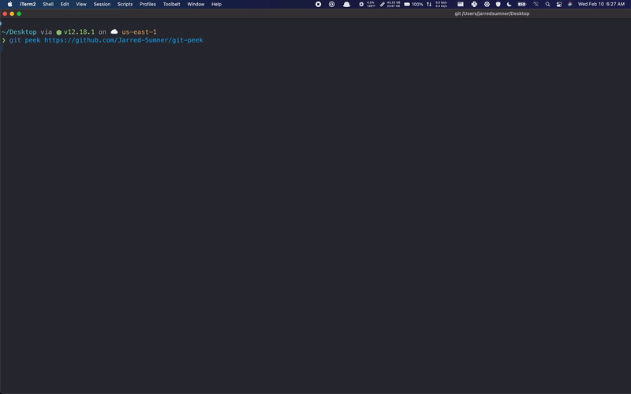

# git-peek

`git peek` is the fastest way to open a remote git repository in your local text editor.

<!-- <video autoplay muted type="video/mp4" src="demo.mp4" autoplay loop muted playsinline width="960" height="600" /> -->


Use it when you want to browse or search other people's code with your own editor.

## Installation:

Installing from npm makes updates easy:

```
npm install -g @jarred/git-peek
```

But there are also [precompiled binaries](https://github.com/Jarred-Sumner/git-peek/releases):

- [Windows x64 – 1.3.2](https://github.com/Jarred-Sumner/git-peek/releases/download/1.3.2/git-peek.exe)
- [macOS x64 – 1.3.2](https://github.com/Jarred-Sumner/git-peek/releases/download/1.3.2/git-peek-macOS)

**NEW**: [Try the chrome/firefox extension](https://github.com/Jarred-Sumner/1-click-from-github-to-editor). It adds an "Open" button to pull requests, files, and repositories, so you can read code with your editor without needing to copy-paste into the terminal. Note: vim and Linux are both not supported yet

## Usage:

```
git peek https://github.com/ylukem/pin-go
git peek https://github.com/jarred-sumner/atbuild
git peek https://github.com/facebook/react/pull/20790
git peek hanford/trends
git peek react
git peek https://github.com/jarred-sumner/fastbench.dev/tree/main/
git peek https://github.com/evanw/esbuild/blob/master/lib/common.ts
```

Pass `git peek` a git repository or a github link, and it will quickly fetch and open it in your local editor. It stores the repository in a temporary directory and deletes it when you close the editor or `git peek`.

It's fast.

```bash
❯ git peek https://github.com/nodejs/node/blob/master/lib/dgram.js
⏳ Extracting repository to temp folder...
💻 Launched editor in 0.20s
```

If you paste a link to a pull request on GitHub, it will open it quickly:

```
❯ git peek https://github.com/facebook/react/pull/20790
💻 Launched editor in 0.13s
⏳ Extracting repository to temp folder...
💿 Finished downloading repository!
```

Much faster than cloning.

If you don't pass `git peek` input, it will let you search Github repositories and show [trending repositories](https://trends.now.sh):

```
❯ git peek
Search Github repositories:
> Search
❯ iam-abbas/Reddit-Stock-T | Fetch currently trending stocks on Reddit
  codeSTACKr/free-develope | Free Developer Resources
  justjavac/1s             | 天若有情天亦老，我为网站加一秒
  PaddlePaddle/PaddleNLP   | NLP Core Library and Model Zoo based on PaddlePa
  ModernPwner/cicuta_viros |
  jevakallio/vscode-live-f | Run your web app inside VS Code
  getActivity/AndroidCodeS | Android 代码规范文档
  gigantz/react-xpress     | React renderer to build Node.js server
```

If you type a repository name without the owner (`react` instead of `facebook/react`), it will search:

```
❯ git peek react
Search Github repositories:
> react
❯ facebook/react           | A declarative, efficient, and flexible JavaScrip
  typescript-cheatsheets/r | Cheatsheets for experienced React developers get
  duxianwei520/react       |  React+webpack+redux+ant design+axios+less全家桶后台管
  discountry/react         | React docs in Chinese | React 中文文档翻译
  Cathy0807/react          | 京东首页构建
  react-redux-antd-es6/rea | 基于react的企业后台管理开发框架
  HackYourFuture/React     | This repository contains all the material for th
  geist-org/react          | Modern and minimalist React UI library.
```

If you paste a link to a file on GitHub, it will quickly open the file in your local editor:

```
❯ git peek https://github.com/Jarred-Sumner/git-peek/blob/main/src/index.ts
💻 Launched editor in 0.39s
⏳ Extracting repository to temp folder...
💿 Finished downloading repository!
```

```bash
❯ git peek -h
 Quickly preview remote Git repositories in your local editor

  USAGE
    $ git-peek [git link or github link or search query or repository file path]

  EXAMPLES
    git peek https://github.com/evanw/esbuild/blob/master/lib/common.ts
    git peek https://github.com/ylukem/pin-go
    git peek https://github.com/jarred-sumner/atbuild
    git peek hanford/trends
    git peek react

  OPTIONS
    -e, --editor=editor  [default: auto] editor to open with, possible values:
                          auto, code, subl, vim, vi, code-insiders.
                          By default, it will search $EDITOR. If not found, it
                          will try code, then subl, then vim.

    -r, --register        [default: false] Register the git-peek:// url protocol
                          This allows the "Open" buttons to work on
                          github.com once you\'ve installed the extension. Only
                          supported on macOS and Windows

    -o, --out=           [default: system temp directory] output directory to
                          store repository files in. If youre cloning a large
                          repo and your tempdir is an in-memory storage (/tmp),
                          maybe change this.

    -w, --wait           [default: false] wait to open the editor until the
                          repository finishes downloading. always on for vi.

    --no-keep            [default: false] keep the repository, rather than
                         deleting it.

    -b, --branch         [default: "master"] select a branch/ref to use.
                         if the repository doesn't use master/main,
                         you'll want to set this manually. but it will
                         try to infer from the input by default.

    -d                   [default: false] Ask the GitHub API
                          for the default_branch to clone.

    -h, --help           show CLI help

  ENVIRONMENT VARIABLES:
    $EDITOR: code --wait
    $GITHUB_TOKEN: ********
    .env: ✅ $HOME/.git-peek

  For use with private GitHub repositories, set $GITHUB_TOKEN to a personal
  access token. To persist it, store it in your shell config or the .env shown above.
```

### Private repositories & choosing an editor

To use `git-peek` with private repositories, set a `$GITHUB_TOKEN` to a personal access token. If you don't want a global shell `$GITHUB_TOKEN`, you can set in `$HOME/.git-peek`.

Its a `.env` file, so the syntax looks like this:

```bash
EDITOR="code"
GITHUB_TOKEN="**********"
```

You can also save a custom editor this way. So you don't have to add `-e vim` everytime if `$EDITOR` is not propagating to the process.

## How does this work?

If you pass it a GitHub repository, it fetches a tarball instead of using git and decompresses it while downloading it (streaming). From unscientific benchmarks, this is about 2x faster than cloning. While downloading & decompressing the tarball, it also downloads the specific file linked to (or the `README.md`) via JSDelivr's CDN. Whichever happens first, it opens in the editor (usually JSDelivr), but it will keep fetching the repo until its complete or the program exits.

If you pass it a git repository rather than a Github url, it does a [partial clone](https://github.blog/2020-12-21-get-up-to-speed-with-partial-clone-and-shallow-clone/) instead of doing a full clone.

When your editor closes or you close `git peek`, it deletes the repository from your computer.

### Changelog

#### `1.3.0 - 1.3.2`

##### Windows

- Add Windows support for registering the `git-peek://` protocol!! (related: https://github.com/Jarred-Sumner/register-url-windows). This enables 1-click open buttons on GitHub. Run `git peek --register`
- Add `./bin/git-peek-win32.exe` that runs `git-peek` without the CMD.exe window appearing (source code is in the `win32` folder). It just receives `git-peek://` URLs, so if you run it by itself, nothing will show up and you'll be kind of confused.

##### Mac

- Prevent homebrew from running cleanup and auto update when you run `git-peek --register`. So that it runs faster.
- Prevent the applescript from stealing focus when you click the open button in the browser extension. To use this, you'll have to re-run `git-peek --register` if you haven't already.

#### Misc

- Temp folder names now start with the `repository@branchOrRef` name e.g. `esbuild@main`, so its clearer what you're looking at in your editor. Its still a long string, but the beginning at least makes more sense now.
- Temp folder names now end in `peekautodelete`. This will later be used for a `git-peek purge` command that will automatically delete any folders it finds in the temp directory containing `"peekautodelete"` incase anything was missed.
- Fix bug where sometimes empty text would appear in your editor when it guessed the default filename wrong. Please open an issue if you see this happen again.
- Will now confirm closing for Sublime Text instead of failing to detect when it closed and then hanging. Sublime Text's `--wait` CLI argument does not support folders, so it's pretty tough to detect when the user closes Sublime Text without some kind of process monitoring.
- Add sourcemap file because why not
- Made the "Deleted repository" log double check that the repository is no longer there before logging it.

---

- `1.2.2`: Prevent process from sticking around longer than necessary if its still extracting the repository when its supposed to close. Add `fs.rmSync` polyfill

- `1.2.1`: Slightly improve reliability & performance of launching the editor (using child_process.spawn instead of using child_process.exec) and allow the AppleScript to launch multiple instances

- `1.2.0`: Create a `git-peek://` URL handler, so that you can click a link to open a repository in your local editor. Register the URL handler with `git peek -r`.

- `1.1.37`: Add easter egg to search results

- `1.1.36`: Add optional `-d` flag that automatically asks github what the default branch is before cloning instead of guessing its either `main` or `master`.

- `1.1.35`: Add optional `--branch` flag so you can choose which branch to clone if its not shown in the url. See [#17](https://github.com/Jarred-Sumner/git-peek/issues/17)

- `1.1.34`: Fix home directory path resolution on Windows

- `1.1.33`: Add precompiled binary for windows in releases script.

- `1.1.32` Add `--no-keep` flag which skips deleting repositories on exit. Fix support for unknown editors. When the editor is unknown, it asks to confirm deleting the repository.

- `1.1.31`: Fix issue where when `vim` is loaded with a specific file (rather than the repository root dir), it would log text on top of `vim`.

### `1.1.30`

git-peek now starts 32% faster (delayed loading `ink` until its used for search)

You can now store `$EDITOR` and `$GITHUB_TOKEN` in `$HOME/.git-peek`. Its a `.env` file, so the syntax looks like this:

```bash
EDITOR="code"
GITHUB_TOKEN="**********"
```

Removed using the `$GITHUB_TOKEN` from `~/.hubs/config`.

- `1.1.28-29`: Fix for Node 12+ [#14](https://github.com/Jarred-Sumner/git-peek/issues/14)
- `1.1.27`: Added `--wait` flag which waits to open the editor until the entire repository is downloaded. Added `--out` flag which changes the temp directory to store files in (see #8)
- `1.1.22-26`: Fix windows bug.
- `1.1.21`: Add Pull Request support. Now you can use this to quickly read a pull request. For example: `git peek https://github.com/facebook/react/pull/20790`.
- `1.1.20`: Fix bug when using with Fedora
- `1.1.16-1.1.19`: trying to get `release-it` to work
- `1.1.15`: Move `code-insiders` to end of preference list
- `1.1.14`: Fix code-insiders and fix passing in editor manually when its `subl` or `code`.
- `1.1.13`: Use `Authorization` header instead of `access_token` query string.
- `1.1.12`: When available, also use github access token for fetching tarballs (instead of just search)
- `1.1.11`: When available, use github access token for github API requests to enable private repositories to work. To enable this, either set a `GITHUB_TOKEN` environment variable or if you've installed [hub](https://github.com/github/hub), it will automatically use `oauth_token` from `$HOME/.config/hub`. In other words, if you use `hub`, this should just work by default.
- `1.1.10`: Fix vim
- `1.1.9`: Fix Windows

Originally inspired by [github1s.com](https://github.com/conwnet/github1s).
